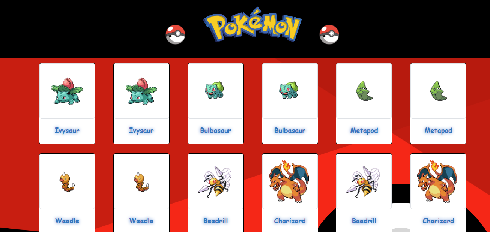
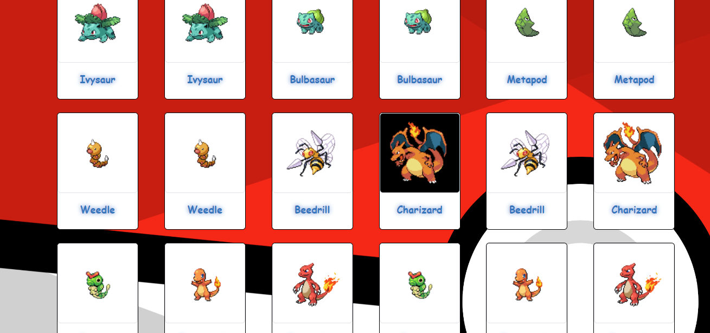
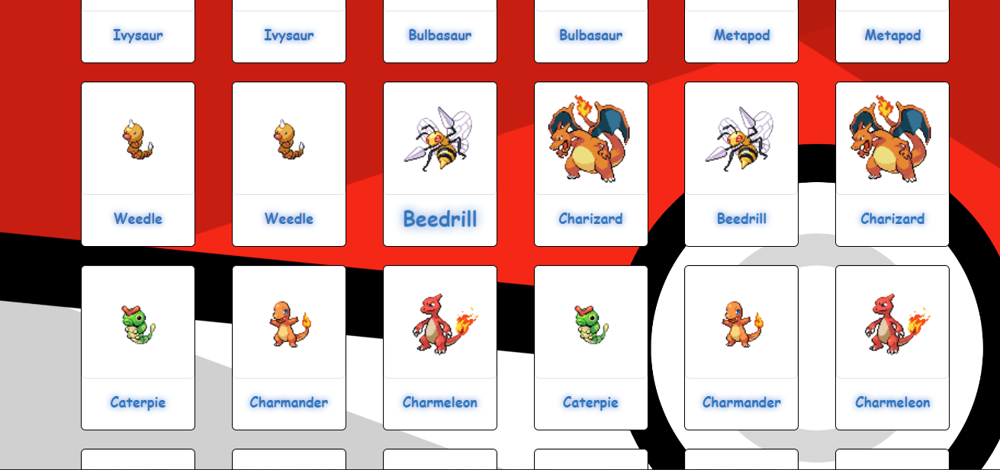

# PokeApi

* [1. Resumen del proyecto](#1-resumen-del-proyecto)
* [2. Investigación UX](#2-investigación-ux)
* [3. Herramientas implementadas](#3-herramientas-implementadas)
* [4. Vista 1 ](#4-vista-1)
* [5. Vista 2 ](#5-vista-2)
* [6. Vista 3 ](#6-vista-3)

***

## 1. Resumen del proyecto

El objetivo del proyecto, consiste en mostrar ciertos personajes random de la Api de pokemon, así como practicar estilos y efectos.

## 2. Investigación UX

Esta aplicación es dirigida a todas aquellas personas interesadas en Pokemon.

## 3. Herramientas Implementadas

CSS, HTML, JAVASCRIPT, REACT y BOOTSTRAP

## 4. Vista 1

## 5. Vista 2

Al momento en que el cursor pase por una imagen, el fondo cambiará a color negro.

## 6. Vista 3

Si el usuario coloca el cursor en cualquier nombre de un pokemon, el tamaño de la letra se hará más grande.

